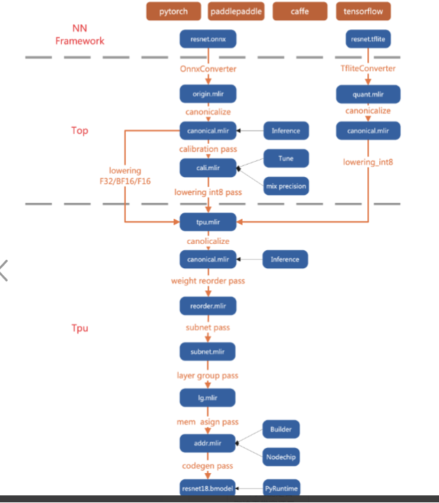
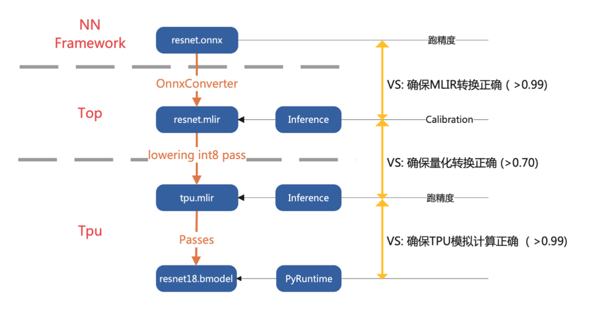
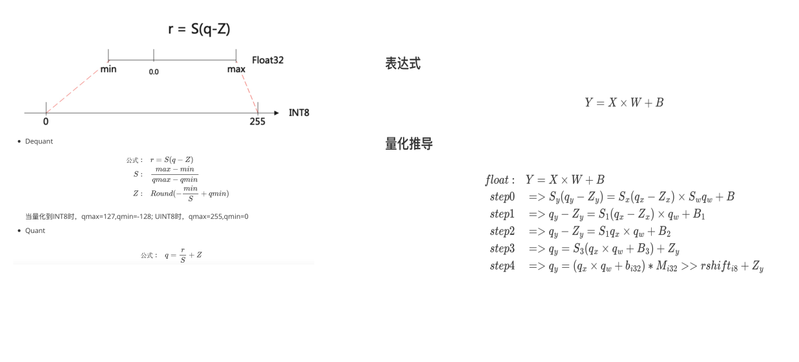

## 1.TPU-MLIR整体架构

- 1.支持多种架构，目前我们用的最多的是pytorch
- 2.分层设计
  - Top层，与芯片无关，包括图优化、量化、推理等
  - Tpu层，与芯片相关层，包括权重重排、算子切分、地址分配、推理等
- 3.正确性保证，多层相似度比较
    - Top层推理结果与onnx结果对比
    - Tpu层推理结果与Top对比
    - Cmodel结果与Tpu对比

- 4.过程可跟踪
    每一步的转换都可以生成MLIR，用于跟踪和调试

## 2.量化

**量化分为两种方式，一种是对称量化，这种是量化为int8（-128，127），非对称量化（0，255）**
